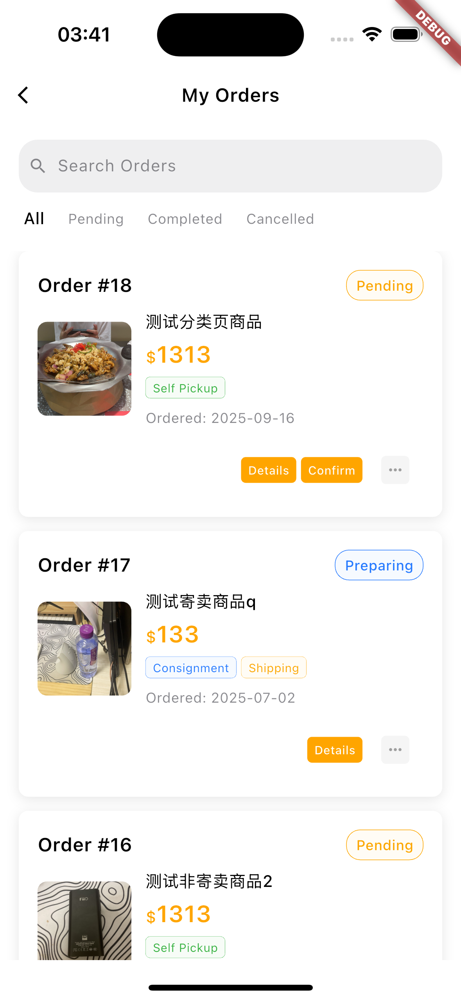
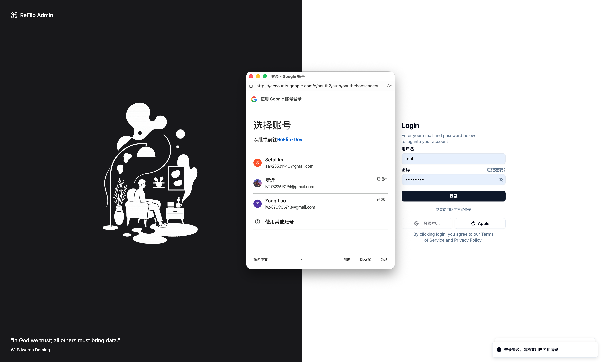
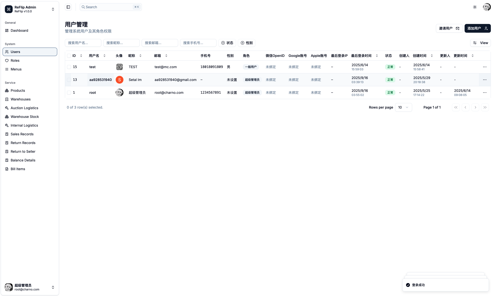

# ReFlip Market（二手家具交易平台）

一个面向二手家具流通的全栈项目，包含后端多模块服务（Spring Boot 3 + MyBatis-Plus + Redis + JWT）、管理后台（React 19 + Vite 6 + Tailwind v4）、以及移动端/客户端（Flutter 3，集成 Google 登录、Google 地图、Stripe 支付、WebSocket 聊天等）。本仓库适合作为完整项目经历展示，体现从系统设计、到工程落地与业务闭环的能力。

## 功能与截图展示

- 用户体系：邮箱/密码登录、Google 登录、权限菜单、用户资料维护
- 商品中心：商品发布、详情浏览、收藏、评论与评分
- 交易与支付：下单、确认订单、Stripe 支付与支付结果反馈
- 仓储与物流：仓库管理、入库/出库、寄卖/自提物流、内部物流任务
- 财务与结算：账单项与支付记录、余额与明细

### 客户端主要页面（Flutter App）

<div align="center">

<table>
  <tr>
    <td align="center">
      <br />主页
    </td>
    <td align="center">
      <br />商品页
    </td>
    <td align="center">
      <br />商品详情页
    </td>
  </tr>
  <tr>
    <td align="center">
      <br />确认订单页
    </td>
    <td align="center">
      <br />订单支付（Stripe）
    </td>
    <td align="center">
      <br />订单支付成功（Stripe）
    </td>
  </tr>
  <tr>
    <td align="center">
      <br />我的订单页
    </td>
    <td align="center">
      <br />个人页
    </td>
    <td align="center">
      <br />登陆门户页
    </td>
  </tr>
  <tr>
    <td align="center">
      <br />谷歌登录页
    </td>
    <td align="center">
      <br />谷歌登录确认页
    </td>
    <td align="center">
  </tr>
</table>

</div>

### 管理后台页面（React Admin）

<div align="center">

<table>
  <tr>
    <td align="center">
      <br />登录页
    </td>
    <td align="center">
      <br />谷歌登录页
    </td>
  </tr>
  <tr>
    <td align="center">
      <br />用户管理页
    </td>
    <td align="center">
      <br />用户编辑信息
    </td>
  </tr>
    <tr>
    <td align="center">
      <br />查看仓库位置（Google Maps）
    </td>
    <td align="center">
  </tr>
</table>

</div>

## 架构概览

- 后端：Maven 多模块（Java 17, Spring Boot 3.5）
  - `backend-start`：应用入口与启动类（`org.charno.start.BackendStartApplication`）
  - `backend-system`：系统域（认证、角色、菜单、文件上传、Google Maps 等）
  - `backend-reflip`：业务域（商品、交易、仓储、物流、财务等）
  - `backend-common`：通用工具与基础设施
- 管理后台：`frontend-panel-react`（React + Vite + Tailwind v4 + TanStack Router）
- 客户端：`frontend-app/reflip_flutter`（Flutter 3，Dio/Google Sign-In/Google Maps/Stripe）

## 技术栈

- 后端：Spring Boot 3.5、MyBatis-Plus 3.5.12、Redis、JWT（jjwt 0.11.5）、Fastjson2、Spring Security Crypto、Jackson JSR310
- 前端（管理后台）：React 19、Vite 6、Tailwind CSS v4、TanStack Router/Query、Zod、Axios、Clerk
- 客户端（Flutter）：Dio、google_sign_in、google_maps_flutter、flutter_stripe、geolocator、geocoding

## 模块与接口

详见 `docs/接口文档.md`，覆盖：

- 认证模块：登录、登出、注册、用户信息、菜单
- 系统管理：用户/角色/菜单、文件上传
- 商品模块：商品/品类 CRUD、按品类计价、买家下单
- 交易模块：出售记录、退货记录
- 物流模块：寄卖/自提物流、内部物流任务、仓库发货记录
- 仓储模块：仓库、入库申请、库存、入库、出库、仓储费用
- 财务模块：账单项、支付记录

## 关键技术说明

- 身份认证与授权：JWT 鉴权、菜单基于角色的访问控制
- 数据访问：MyBatis-Plus 帮助快速 CRUD 与分页；业务表结构详见 `docs/*.sql` 与 `sql/*.sql`
- 第三方集成：
  - Google 登录（Flutter、React）
  - Google Maps（后台查看仓库位置、Flutter 端地图能力）
  - Stripe 支付（下单、支付成功回调）

## 目录结构

```
ReFurn-Market/
├── backend-start/                    # 应用启动模块
├── backend-system/                   # 系统管理模块
├── backend-reflip/                   # 核心业务模块
├── backend-common/                   # 公共模块
├── frontend-panel-react/             # React 管理后台
│   ├── src/
│   │   ├── components/               # 通用组件
│   │   ├── features/                 # 功能模块
│   │   │   ├── auth/                    # 认证模块
│   │   │   ├── users/                   # 用户管理
│   │   │   ├── products/                # 商品管理
│   │   │   ├── warehouse/               # 仓储管理
│   │   │   ├── logistics/               # 物流管理
│   │   │   └── finance/                 # 财务管理
│   │   ├── api/                      # API 接口
│   │   ├── hooks/                    # 自定义 Hooks
│   │   ├── stores/                   # 状态管理
│   │   ├── types/                    # TypeScript 类型
│   │   └── utils/                    # 工具函数
│   ├── public/                       # 静态资源
│   ├── package.json                  # 依赖配置
│   └── vite.config.ts               # Vite 配置
│
├── frontend-app/                     # Flutter 客户端
│   └── reflip_flutter/
│       ├── lib/
│       │   ├── config/               # 配置文件
│       │   │   └── api_config.dart       # API 配置
│       │   ├── models/               # 数据模型
│       │   ├── services/             # 服务层
│       │   ├── screens/              # 页面
│       │   │   ├── auth/                 # 认证页面
│       │   │   ├── home/                 # 首页
│       │   │   ├── products/             # 商品页面
│       │   │   ├── orders/               # 订单页面
│       │   │   └── profile/              # 个人中心
│       │   ├── widgets/              # 组件
│       │   └── utils/                # 工具类
│       ├── assets/                   # 资源文件
│       │   ├── images/               # 图片资源
│       │   └── icons/                # 图标资源
│       └── pubspec.yaml              # Flutter 依赖配置
```

## License

本项目用于学习与展示，若需商用或二次开发请先联系作者并注明出处。