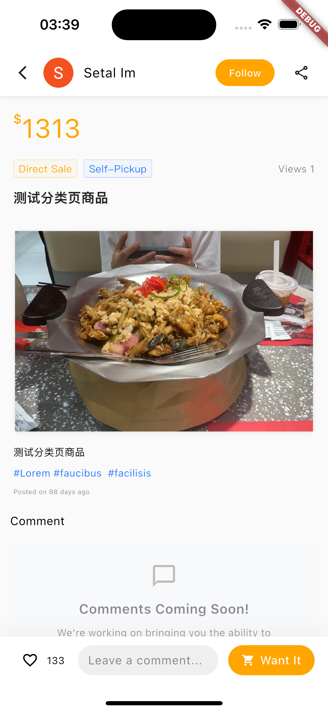
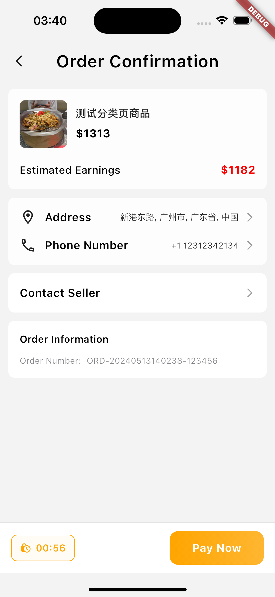
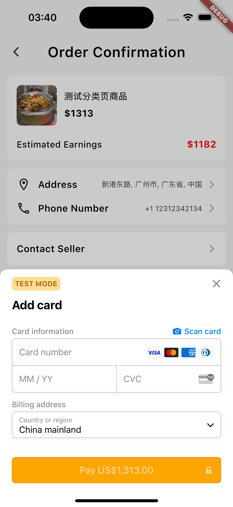
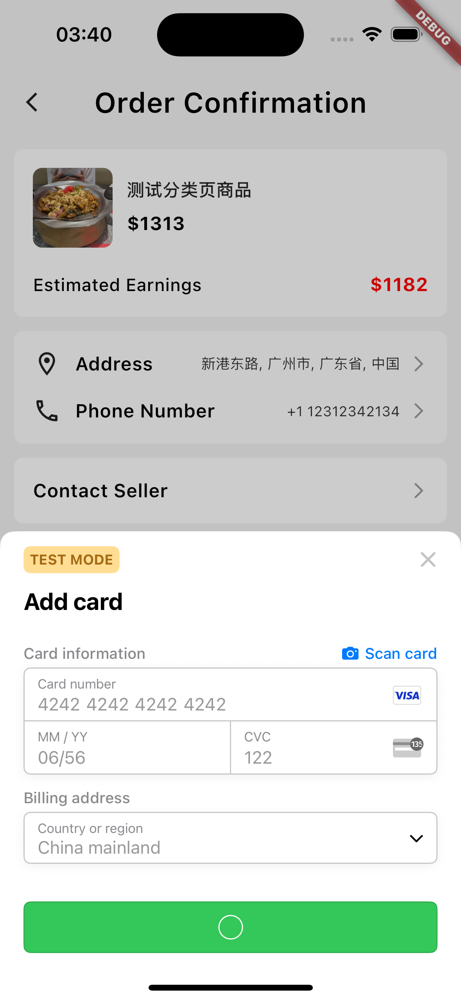
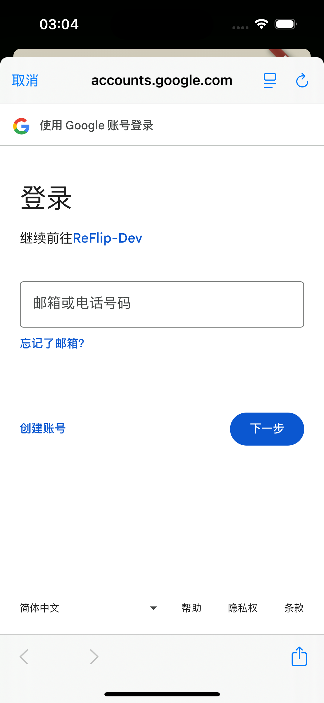

# ReFlip Market (Second-hand Furniture Trading Platform)

A full-stack project for second-hand furniture circulation, including backend multi-module services (Spring Boot 3 + MyBatis-Plus + Redis + JWT), admin panel (React 19 + Vite 6 + Tailwind v4), and mobile/client applications (Flutter 3, integrated with Google Sign-In, Google Maps, Stripe payment, etc.). This repository is suitable as a complete project experience showcase, demonstrating capabilities from system design to engineering implementation and business process closure.

## Features & Screenshots

- User System: Email/password login, Google Sign-In, permission menus, user profile management
- Product Center: Product publishing, detail browsing, favorites, comments and ratings
- Trading & Payment: Order placement, order confirmation, Stripe payment and payment result feedback
- Warehouse & Logistics: Warehouse management, inbound/outbound, consignment/self-pickup logistics, internal logistics tasks
- Finance & Settlement: Bill items and payment records, balance and details

### Client Main Pages (Flutter App)

<div align="center">

<table>
  <tr>
    <td align="center">
      <br />Home Page
    </td>
    <td align="center">
      <br />Products Page
    </td>
    <td align="center">
      <br />Product Details
    </td>
  </tr>
  <tr>
    <td align="center">
      <br />Order Confirmation
    </td>
    <td align="center">
      <br />Order Payment (Stripe)
    </td>
    <td align="center">
      <br />Payment Success (Stripe)
    </td>
  </tr>
  <tr>
    <td align="center">
      <br />My Orders
    </td>
    <td align="center">
      <br />Profile Page
    </td>
    <td align="center">
      <br />Login Portal
    </td>
  </tr>
  <tr>
    <td align="center">
      <br />Google Login
    </td>
    <td align="center">
      <br />Google Login Confirmation
    </td>
    <td align="center">
    </td>
  </tr>
</table>

</div>

### Admin Panel Pages (React Admin)

<div align="center">

<table>
  <tr>
    <td align="center">
      <br />Login Page
    </td>
    <td align="center">
      <br />Google Login
    </td>
  </tr>
  <tr>
    <td align="center">
      <br />User Management
    </td>
    <td align="center">
      <br />User Edit
    </td>
  </tr>
    <tr>
    <td align="center">
      <br />Warehouse Location (Google Maps)
    </td>
    <td align="center">
    </td>
  </tr>
</table>

</div>

## Architecture Overview

- Backend: Maven multi-module (Java 17, Spring Boot 3.5)
  - `backend-start`: Application entry and startup class (`org.charno.start.BackendStartApplication`)
  - `backend-system`: System domain (authentication, roles, menus, file upload, Google Maps, etc.)
  - `backend-reflip`: Business domain (products, trading, warehouse, logistics, finance, etc.)
  - `backend-common`: Common utilities and infrastructure
- Admin Panel: `frontend-panel-react` (React + Vite + Tailwind v4 + TanStack Router)
- Client: `frontend-app/reflip_flutter` (Flutter 3, Dio/Google Sign-In/Google Maps/Stripe)

## Tech Stack

- Backend: Spring Boot 3.5, MyBatis-Plus 3.5.12, Redis, JWT (jjwt 0.11.5), Fastjson2, Spring Security Crypto, Jackson JSR310
- Frontend (Admin Panel): React 19, Vite 6, Tailwind CSS v4, TanStack Router/Query, Zod, Axios, Clerk
- Client (Flutter): Dio, google_sign_in, google_maps_flutter, flutter_stripe, geolocator, geocoding

## Modules & APIs

See `docs/接口文档.md` for details, covering:

- Authentication Module: Login, logout, registration, user info, menus
- System Management: Users/roles/menus, file upload
- Product Module: Product/category CRUD, category-based pricing, buyer orders
- Trading Module: Sales records, return records
- Logistics Module: Consignment/self-pickup logistics, internal logistics tasks, warehouse shipment records
- Warehouse Module: Warehouses, inbound applications, inventory, inbound/outbound, warehouse costs
- Finance Module: Bill items, payment records

## Key Technical Features

- Authentication & Authorization: JWT authentication, role-based access control for menus
- Data Access: MyBatis-Plus for rapid CRUD and pagination; business table structures see `docs/*.sql` and `sql/*.sql`
- Third-party Integrations:
  - Google Sign-In (Flutter, React)
  - Google Maps (admin warehouse location viewing, Flutter map capabilities)
  - Stripe Payment (order placement, payment success callbacks)

## Directory Structure

```
ReFurn-Market/
├── backend-start/                    # Application startup module
├── backend-system/                   # System management module
├── backend-reflip/                   # Core business module
├── backend-common/                   # Common module
├── frontend-panel-react/             # React admin panel
│   ├── src/
│   │   ├── components/               # Common components
│   │   ├── features/                 # Feature modules
│   │   │   ├── auth/                    # Authentication module
│   │   │   ├── users/                   # User management
│   │   │   ├── products/                # Product management
│   │   │   ├── warehouse/               # Warehouse management
│   │   │   ├── logistics/               # Logistics management
│   │   │   └── finance/                 # Finance management
│   │   ├── api/                      # API interfaces
│   │   ├── hooks/                    # Custom Hooks
│   │   ├── stores/                   # State management
│   │   ├── types/                    # TypeScript types
│   │   └── utils/                    # Utility functions
│   ├── public/                       # Static resources
│   ├── package.json                  # Dependency configuration
│   └── vite.config.ts               # Vite configuration
│
├── frontend-app/                     # Flutter client
│   └── reflip_flutter/
│       ├── lib/
│       │   ├── config/               # Configuration files
│       │   │   └── api_config.dart       # API configuration
│       │   ├── models/               # Data models
│       │   ├── services/             # Service layer
│       │   ├── screens/              # Pages
│       │   │   ├── auth/                 # Authentication pages
│       │   │   ├── home/                 # Home page
│       │   │   ├── products/             # Product pages
│       │   │   ├── orders/               # Order pages
│       │   │   └── profile/              # Profile center
│       │   ├── widgets/              # Components
│       │   └── utils/                # Utility classes
│       ├── assets/                   # Resource files
│       │   ├── images/               # Image resources
│       │   └── icons/                # Icon resources
│       └── pubspec.yaml              # Flutter dependency configuration
```

## License

This project is for learning and demonstration purposes. For commercial use or secondary development, please contact the author first and indicate the source.
