# ReFlip Market（中古家具取引プラットフォーム）

中古家具流通向けのフルスタックプロジェクトで、バックエンド多モジュールサービス（Spring Boot 3 + MyBatis-Plus + Redis + JWT）、管理画面（React 19 + Vite 6 + Tailwind v4）、モバイル/クライアントアプリ（Flutter 3、Google ログイン、Google マップ、Stripe 決済などを統合）を含みます。

## 機能とスクリーンショット

- ユーザーシステム：メール/パスワードログイン、Google ログイン、権限メニュー、ユーザープロフィール管理
- 商品センター：商品投稿、詳細閲覧、お気に入り、コメントと評価
- 取引と決済：注文、注文確認、Stripe 決済と決済結果フィードバック
- 倉庫と物流：倉庫管理、入庫/出庫、委託/自己受取物流、内部物流タスク
- 財務と決済：請求項目と支払い記録、残高と明細

### クライアント主要ページ（Flutter アプリ）

<div align="center">

<table>
  <tr>
    <td align="center">
      <br />ホームページ
    </td>
    <td align="center">
      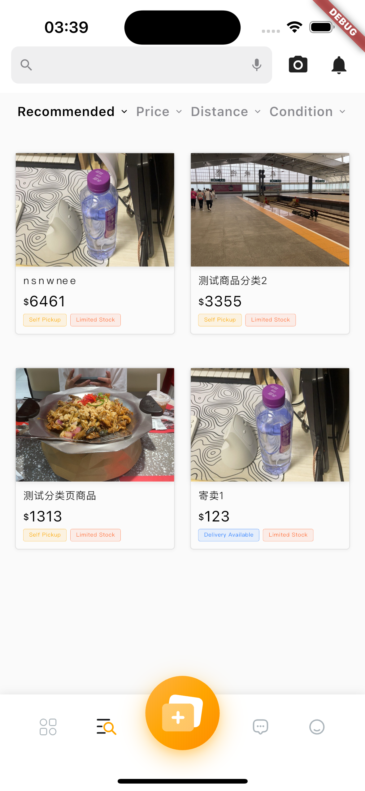<br />商品ページ
    </td>
    <td align="center">
      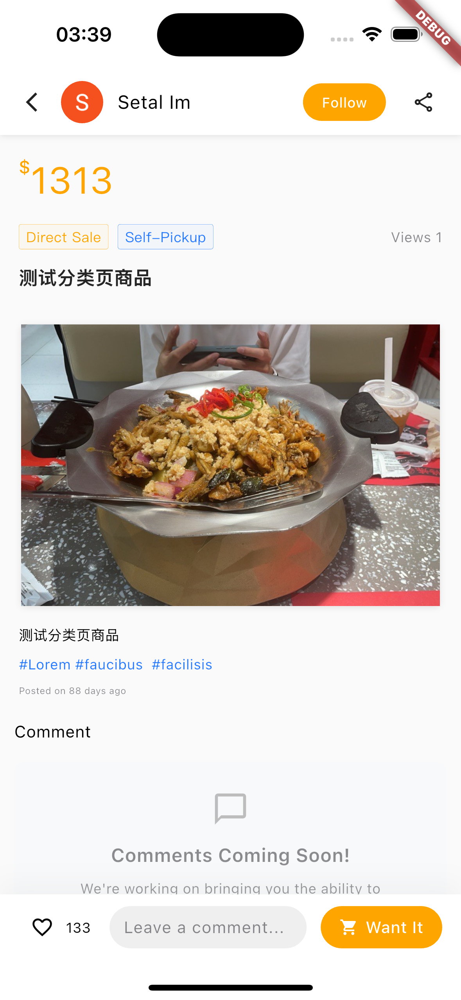<br />商品詳細
    </td>
  </tr>
  <tr>
    <td align="center">
      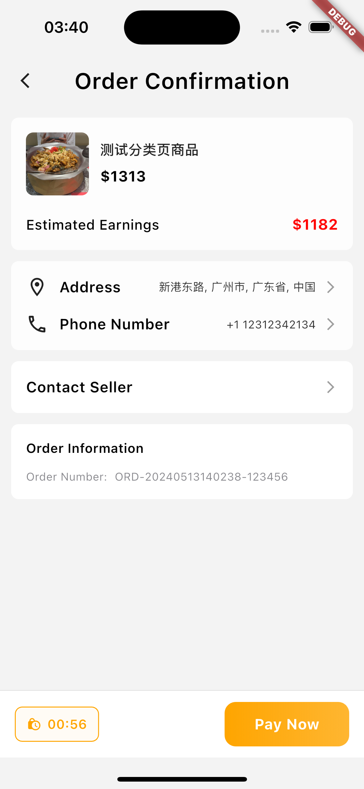<br />注文確認
    </td>
    <td align="center">
      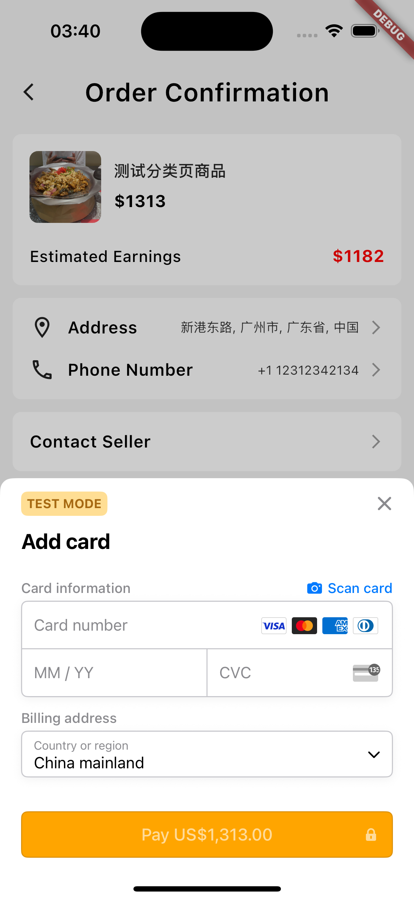<br />注文決済（Stripe）
    </td>
    <td align="center">
      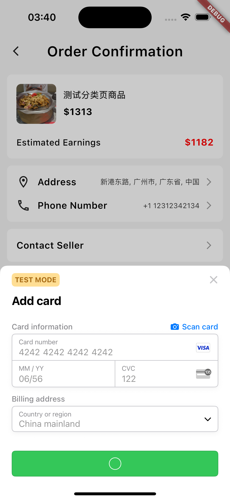<br />決済成功（Stripe）
    </td>
  </tr>
  <tr>
    <td align="center">
      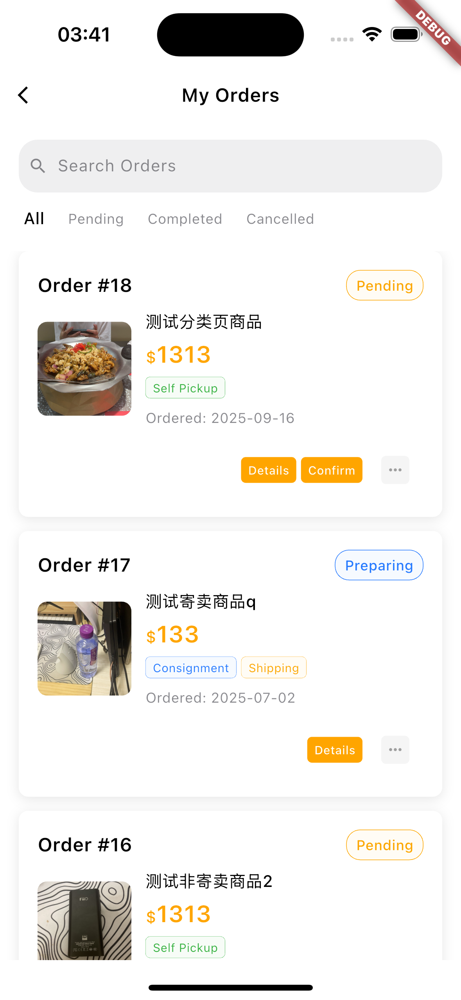<br />マイ注文
    </td>
    <td align="center">
      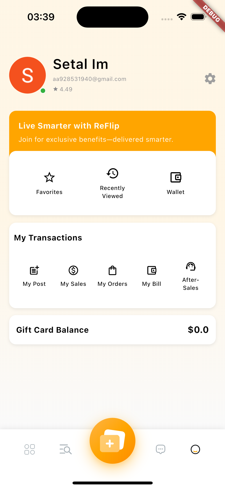<br />個人ページ
    </td>
    <td align="center">
      <br />ログインポータル
    </td>
  </tr>
  <tr>
    <td align="center">
      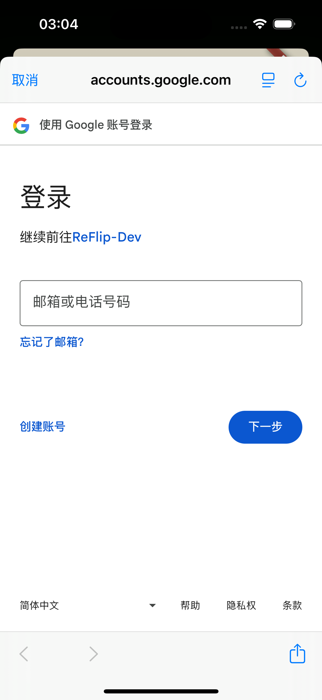<br />Google ログイン
    </td>
    <td align="center">
      <br />Google ログイン確認
    </td>
    <td align="center">
    </td>
  </tr>
</table>

</div>

### 管理画面ページ（React 管理画面）

<div align="center">

<table>
  <tr>
    <td align="center">
      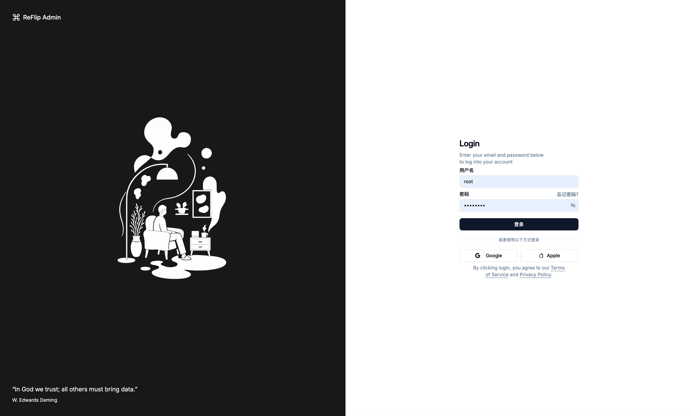<br />ログインページ
    </td>
    <td align="center">
      <br />Google ログイン
    </td>
  </tr>
  <tr>
    <td align="center">
      <br />ユーザー管理
    </td>
    <td align="center">
      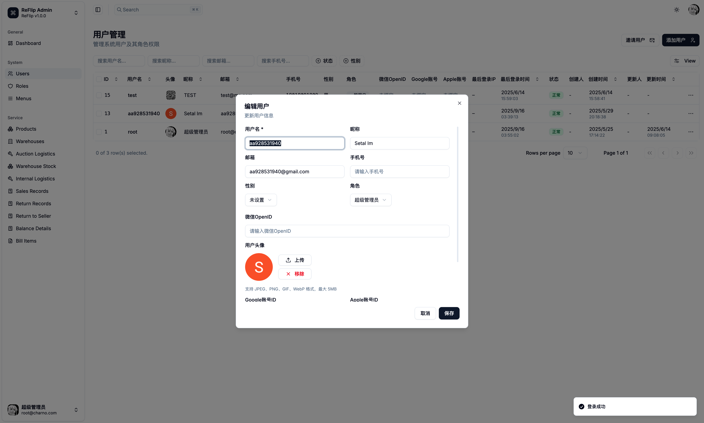<br />ユーザー編集
    </td>
  </tr>
    <tr>
    <td align="center">
      <br />倉庫位置確認（Google マップ）
    </td>
    <td align="center">
    </td>
  </tr>
</table>

</div>

## アーキテクチャ概要

- バックエンド：Maven マルチモジュール（Java 17, Spring Boot 3.5）
  - `backend-start`：アプリケーションエントリとスタートアップクラス（`org.charno.start.BackendStartApplication`）
  - `backend-system`：システムドメイン（認証、ロール、メニュー、ファイルアップロード、Google マップなど）
  - `backend-reflip`：ビジネスドメイン（商品、取引、倉庫、物流、財務など）
  - `backend-common`：共通ユーティリティとインフラストラクチャ
- 管理画面：`frontend-panel-react`（React + Vite + Tailwind v4 + TanStack Router）
- クライアント：`frontend-app/reflip_flutter`（Flutter 3、Dio/Google Sign-In/Google Maps/Stripe）

### 商品流通エンティティ関係図

<div align="center">

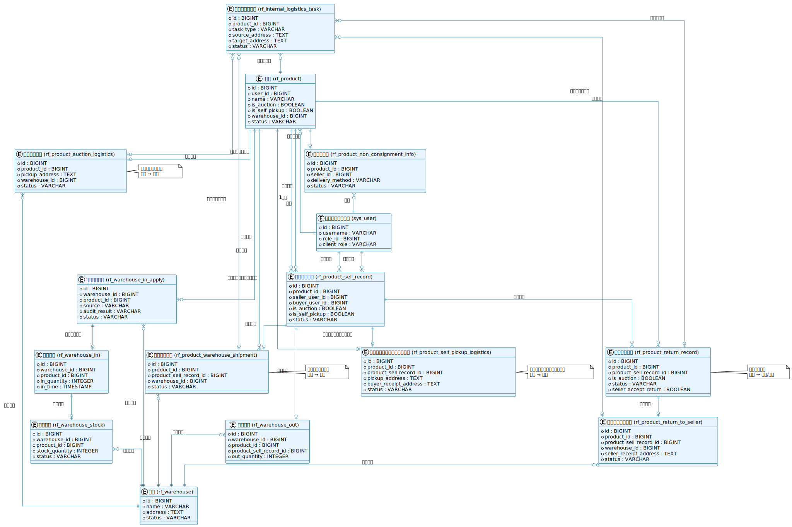

*商品流通エンティティ関係図 - 委託販売モード、セルフピックアップモード、返品プロセスのデータエンティティ関係を示す*

</div>

## 技術スタック

- バックエンド：Spring Boot 3.5、MyBatis-Plus 3.5.12、Redis、JWT（jjwt 0.11.5）、Fastjson2、Spring Security Crypto、Jackson JSR310
- フロントエンド（管理画面）：React 19、Vite 6、Tailwind CSS v4、TanStack Router/Query、Zod、Axios、Clerk
- クライアント（Flutter）：Dio、google_sign_in、google_maps_flutter、flutter_stripe、geolocator、geocoding

## モジュールとAPI

詳細は `docs/接口文档.md` を参照、以下をカバー：

- 認証モジュール：ログイン、ログアウト、登録、ユーザー情報、メニュー
- システム管理：ユーザー/ロール/メニュー、ファイルアップロード
- 商品モジュール：商品/カテゴリ CRUD、カテゴリベース価格設定、購入者注文
- 取引モジュール：販売記録、返品記録
- 物流モジュール：委託/自己受取物流、内部物流タスク、倉庫出荷記録
- 倉庫モジュール：倉庫、入庫申請、在庫、入庫/出庫、倉庫費用
- 財務モジュール：請求項目、支払い記録

## 主要技術機能

- 認証と認可：JWT 認証、メニューのロールベースアクセス制御
- データアクセス：MyBatis-Plus による迅速な CRUD とページネーション；ビジネステーブル構造は `docs/*.sql` と `sql/*.sql` を参照
- サードパーティ統合：
  - Google ログイン（Flutter、React）
  - Google マップ（管理画面での倉庫位置確認、Flutter マップ機能）
  - Stripe 決済（注文、決済成功コールバック）

## ディレクトリ構造

```
ReFurn-Market/
├── backend-start/                    # アプリケーションスタートアップモジュール
├── backend-system/                   # システム管理モジュール
├── backend-reflip/                   # コアビジネスモジュール
├── backend-common/                   # 共通モジュール
├── frontend-panel-react/             # React 管理画面
│   ├── src/
│   │   ├── components/               # 共通コンポーネント
│   │   ├── features/                 # 機能モジュール
│   │   │   ├── auth/                    # 認証モジュール
│   │   │   ├── users/                   # ユーザー管理
│   │   │   ├── products/                # 商品管理
│   │   │   ├── warehouse/               # 倉庫管理
│   │   │   ├── logistics/               # 物流管理
│   │   │   └── finance/                 # 財務管理
│   │   ├── api/                      # API インターフェース
│   │   ├── hooks/                    # カスタム Hooks
│   │   ├── stores/                   # 状態管理
│   │   ├── types/                    # TypeScript タイプ
│   │   └── utils/                    # ユーティリティ関数
│   ├── public/                       # 静的リソース
│   ├── package.json                  # 依存関係設定
│   └── vite.config.ts               # Vite 設定
│
├── frontend-app/                     # Flutter クライアント
│   └── reflip_flutter/
│       ├── lib/
│       │   ├── config/               # 設定ファイル
│       │   │   └── api_config.dart       # API 設定
│       │   ├── models/               # データモデル
│       │   ├── services/             # サービス層
│       │   ├── screens/              # ページ
│       │   │   ├── auth/                 # 認証ページ
│       │   │   ├── home/                 # ホームページ
│       │   │   ├── products/             # 商品ページ
│       │   │   ├── orders/               # 注文ページ
│       │   │   └── profile/              # プロフィールセンター
│       │   ├── widgets/              # コンポーネント
│       │   └── utils/                # ユーティリティクラス
│       ├── assets/                   # リソースファイル
│       │   ├── images/               # 画像リソース
│       │   └── icons/                # アイコンリソース
│       └── pubspec.yaml              # Flutter 依存関係設定
```

## ライセンス

このプロジェクトは学習とデモンストレーション目的です。商用利用や二次開発の場合は、まず作者に連絡し、出典を明記してください。
